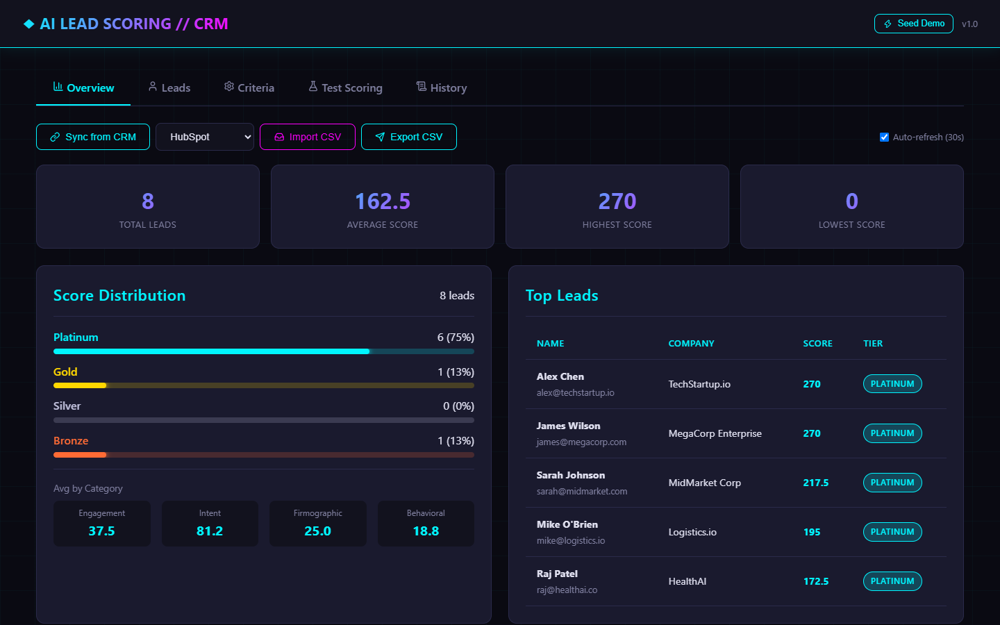
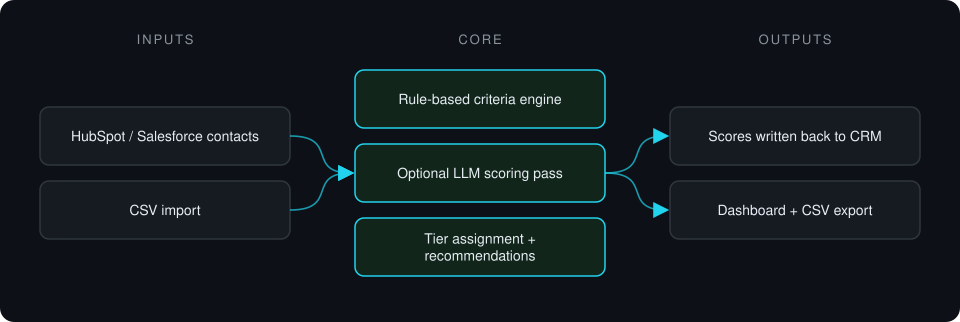

# AI Lead Scoring for CRM

**Pulls leads from a CRM, scores them with transparent rule-based and optional AI criteria, assigns tiers and writes the scores back.**

> **This is a proprietary project. Source code is private. This page showcases the system's architecture and results.**

**Case study page:** [https://jryahia.github.io/showcase-ai-lead-scoring/](https://jryahia.github.io/showcase-ai-lead-scoring/)

## Problem it solves

Sales teams waste time on leads that were never going to close, and black-box scores are hard to trust. This system scores leads on visible criteria across engagement, intent, firmographic and behavioral categories, and syncs the result back to the CRM where reps already work.

## Architecture

1. Leads are fetched from the CRM or imported from CSV.
2. Each lead is scored against configurable weighted criteria, with an optional AI pass.
3. Leads get a tier and next-step recommendations.
4. Scores and tiers are written back to CRM custom properties.

## Key features

- Configurable criteria grouped into four categories
- Optional AI scoring with plain-language reasoning
- Platinum / Gold / Silver / Bronze tiers
- Two-way HubSpot sync; Salesforce client on the same interface
- Batch scoring, CSV import and export
- Optional bearer-token API protection

## Tech stack

     

## What it does in practice

- Gives reps a ranked list with the reasons behind each score, inside the CRM they already use.

## Screenshots

**Score distribution and top leads**

---

Built by [Yahya Jarray](https://github.com/jryahia). Interested in a similar system? [Get in touch](mailto:yahiajarray43@gmail.com).
